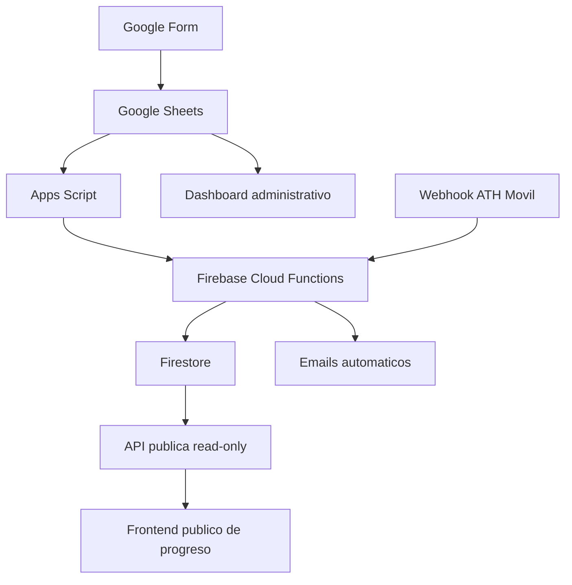

# Abrazo Solidario para Junelly

> Landing publica de recaudacion y documentacion tecnica para un sistema real de inscripcion y donaciones de un evento benefico 5K.

## Live demo

Pendiente: agregar URL de GitHub Pages cuando el despliegue este activo.

## Resumen

Abrazo Solidario para Junelly es una pagina publica de recaudacion para un evento benefico 5K. La landing esta enfocada en la causa, instrucciones para donar, progreso y aportaciones de ejemplo. La documentacion tecnica vive en este README y en `docs/`, sin exponer backend privado, datos sensibles, credenciales, registros reales ni informacion privada de participantes o donantes.

## Problema

Un evento comunitario necesita recibir inscripciones, confirmar donaciones, asignar numeros de corredor, corregir errores operacionales y comunicar progreso publico sin cargar a la organizacion con costos altos o herramientas complejas.

## Solucion

El sistema combina herramientas de bajo costo y servicios serverless:

- Google Forms para capturar registros.
- Google Sheets como dashboard administrativo.
- Apps Script para acciones operacionales.
- Firebase Cloud Functions para logica serverless.
- Firestore para datos persistentes.
- Webhooks de ATH Movil para donaciones/pagos.
- Una futura API publica read-only para datos sanitizados.
- Este frontend estatico para mostrar progreso publico.

## Funcionalidades principales

- Hero publico enfocado en la causa y el evento 5K.
- Barra de progreso de recaudacion.
- Total recaudado, meta, donantes, promedio y participantes.
- Galeria visual con placeholders reemplazables.
- Instrucciones para donar con ATH Movil usando pATH.
- Lista paginada de aportaciones con datos falsos.
- Detalles del evento.
- Botones principales para registrarse, donar y ver ubicacion.
- Preparado para usar datos locales o una API publica futura.

## Tech stack

- HTML
- CSS
- JavaScript vanilla
- GitHub Pages o hosting estatico similar

## Arquitectura



## Como funciona el frontend

El archivo `src/main.js` contiene una variable de configuracion:

```js
const PUBLIC_SUMMARY_API_URL = "";
```

Cuando esta vacia, la pagina usa `src/sample-data.js`. Cuando exista una API publica real, se puede colocar la URL read-only para obtener datos sanitizados sin exponer Firestore ni credenciales privadas al navegador.

## Estrategia de API publica

La API publica futura debe devolver solamente resumenes sanitizados, por ejemplo:

- meta de recaudacion
- total recaudado
- cantidad de donantes
- cantidad de participantes
- mensajes aprobados y anonimizados

El frontend no debe conectarse directamente a Firestore ni contener secretos de Firebase, ATH Movil, email providers o Apps Script.

## Privacidad y seguridad

Este repositorio es publico y esta enfocado en el frontend/case study. El backend real existe, pero no se incluye para proteger datos privados, flujos internos, credenciales y logs operacionales. Todos los datos incluidos aqui son falsos o de ejemplo.

## Arquitectura de bajo costo

La solucion fue disenada para un contexto benefico/sin fines de lucro. La meta tecnica es hacer lo maximo posible con lo menos posible, usando servicios gratuitos o de bajo costo cuando sea razonable y manteniendo una ruta clara para escalar si el volumen crece.

## Screenshots

Pendiente: agregar capturas del frontend cuando el diseno este aprobado.

## Mejoras futuras

- Conectar API publica real de progreso.
- Agregar CI/CD para despliegue.
- Incluir screenshots del dashboard con datos ficticios.
- Mejorar visualizacion de donaciones por periodo.
- Agregar metricas de disponibilidad y costos.
- Implementar consentimiento opcional para mostrar nombres de donantes.

## Autor

Built by Janiel Núñez.

Este proyecto fue construido para presentar una solucion real de impacto comunitario como pieza profesional de portafolio y resume.
