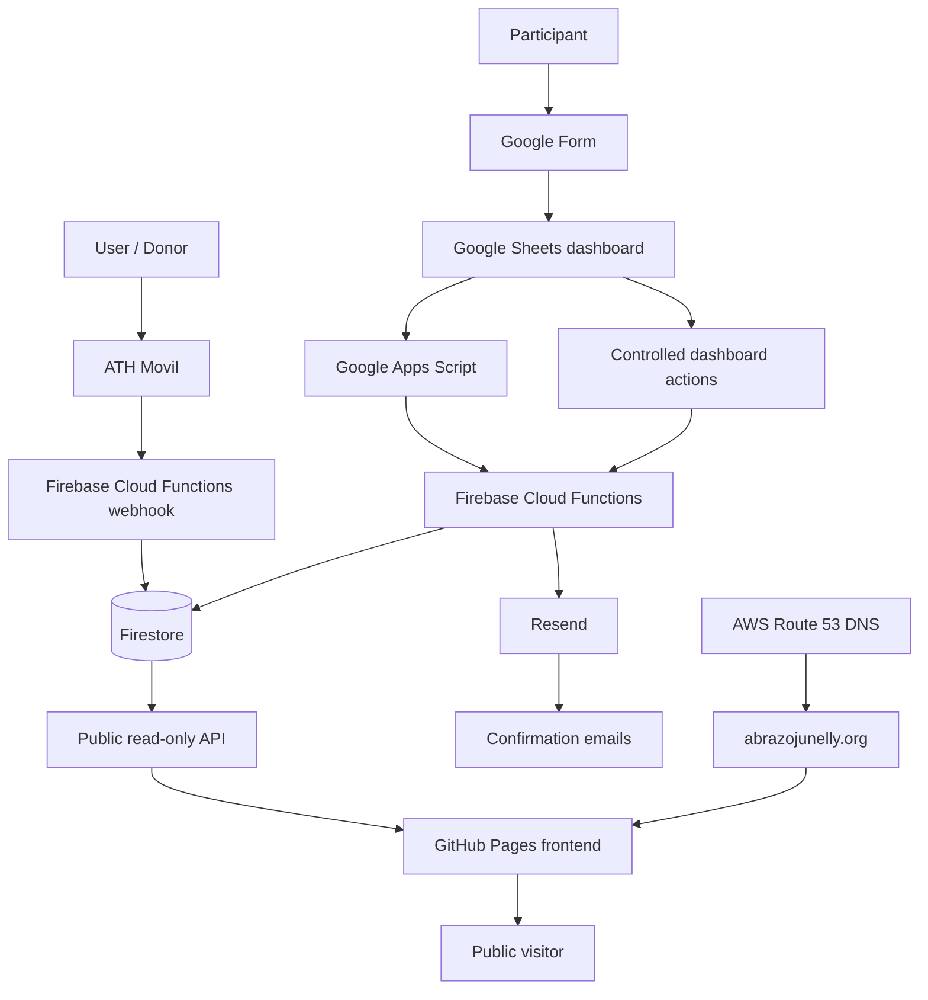
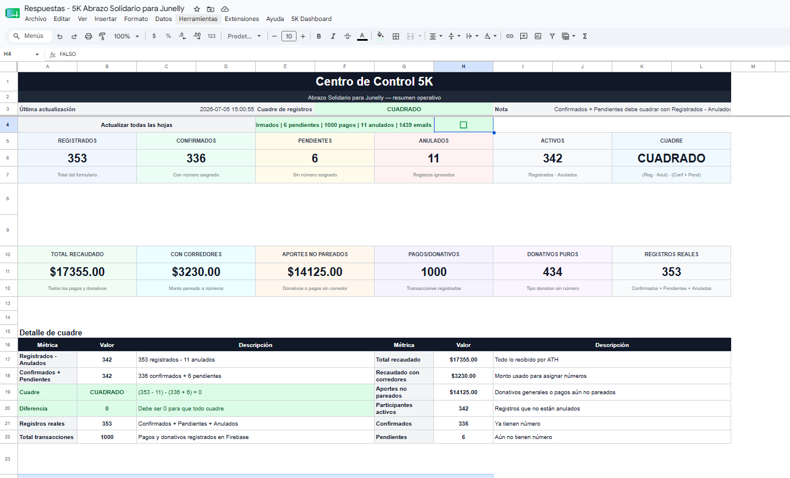
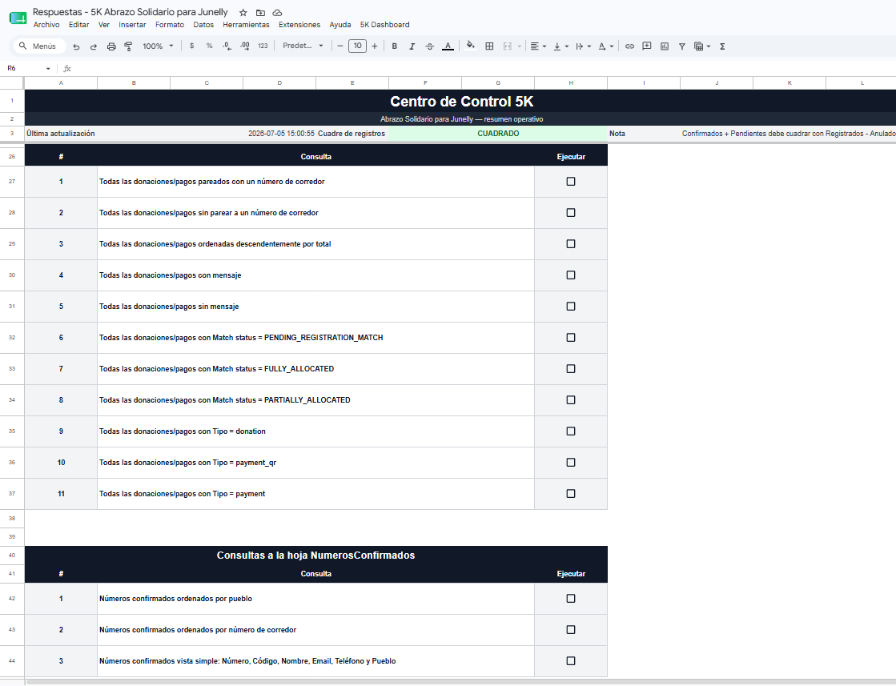

# Abrazo Solidario Junelly

> A production charity fundraising and 5K registration platform built with a serverless, low-cost architecture.

## Live Site

- Public site: [https://abrazojunelly.org](https://abrazojunelly.org)
- Public frontend repository: [Janiel777/abrazo-junelly-frontend](https://github.com/Janiel777/abrazo-junelly-frontend)

The public website is in Spanish because it serves a Puerto Rico community audience. This repository documentation is in English for recruiters, hiring managers, and technical reviewers.

## Overview

Abrazo Solidario Junelly is a real-world platform built for a community charity 5K event in Puerto Rico. The system supports public fundraising progress, participant registration operations, donation processing, runner number assignment, confirmation emails, manual corrections, and privacy-conscious public reporting.

This public repository contains the static frontend, public assets, fallback sample data, public API integration logic, README, and technical documentation. The production backend, private operational workflows, credentials, and real private records are intentionally not included.

## Problem

A community charity event needed a low-cost way to collect registrations, process donations, confirm participants, assign runner numbers, correct mistakes, track donations, send emails, and show public progress without building or maintaining a large custom admin application.

The workflow also needed to handle real operational edge cases: duplicate registrations, extra donations, payment-to-registration matching, manual corrections, voided or burned runner numbers, pickup codes, audit history, and public reporting that does not expose private participant or donor data.

## Solution

The complete system combines practical operational tools with serverless backend services:

- Google Forms captures participant registration intake.
- Google Sheets acts as an interactive operational dashboard.
- Google Apps Script automates dashboard actions and controlled admin workflows.
- Firebase Cloud Functions Gen 2 handles backend logic, public APIs, donation webhooks, Firestore updates, and email workflows.
- Firestore stores registrations, donations, audit logs, email batches, and operational state.
- ATH Movil webhook processing records donation events.
- Automated matching pairs donations with registrations when possible.
- Resend sends confirmation emails and operational email batches.
- GitHub Pages hosts the public fundraising progress website on a custom domain.
- AWS Route 53 manages the hosted zone and DNS records for the custom domain.

## Key Features

- Public fundraising progress dashboard.
- Public read-only sanitized donation summary API.
- Paginated public donation grid.
- Media gallery and donation instructions.
- Registration intake through Google Forms.
- Automated runner number assignment.
- Donation-to-registration matching.
- Extra donation handling.
- Manual admin correction workflows.
- Duplicate and voided registration handling.
- Burned runner number support for operational consistency.
- Pickup code generation.
- Email confirmation batches through Resend.
- Admin dashboard through Google Sheets and Apps Script.
- Controlled dashboard interactions that call Firebase Cloud Functions to update Firestore.
- Audit-friendly operational records and correction history.
- Privacy-conscious public API with no direct database exposure.

## Tech Stack

### Frontend

- HTML
- CSS
- Vanilla JavaScript
- Responsive design
- GitHub Pages
- Custom domain

### Backend

- Firebase Cloud Functions Gen 2
- Node.js
- Firebase Admin SDK
- Firestore
- HTTP webhooks
- Serverless architecture

### Data / Operations

- Google Forms
- Google Sheets
- Google Apps Script
- Firestore collections for registrations, donations, email batches, audit logs, and dashboard workflows

### Payments / Donations

- ATH Movil webhook flow
- Payment and donation event processing
- Donation-to-registration matching
- Extra donation handling
- Public sanitized donation summaries

### Email

- Resend for automated confirmation emails
- Email batch processing
- Provider-backed email delivery
- AWS SES evaluated as a lower-cost pay-as-you-go migration path

### Infrastructure

- GitHub Pages for the public frontend
- AWS Route 53 hosted zone and DNS records for `abrazojunelly.org`
- Firebase Hosting redirects and branded links
- Firebase Cloud Functions deployment for backend services
- Low-cost nonprofit-oriented architecture

### Security / Privacy

- Public read-only API
- Sanitized public responses
- No direct Firestore access from the browser
- No secrets in the frontend
- No emails, phone numbers, ATH phone numbers, reference numbers, registration IDs, pickup codes, or internal dashboard data exposed publicly
- CORS configured for public read-only access
- Separation between public frontend and private backend operations

## Architecture



## Repository Scope

This repository includes:

- Public frontend
- Static assets
- README and documentation
- Sample fallback data
- Public API integration logic
- GitHub Pages custom domain configuration
- Sanitized dashboard screenshots used as product evidence

This repository does not include:

- Production backend source with secrets
- Private Firestore data
- Private Google Apps Script dashboard code unless intentionally documented
- Real participant private records
- Real donor private contact information
- API secrets
- Service account keys
- Internal payment reference numbers
- Pickup codes or private operational identifiers

## Public API Strategy

The frontend consumes a public read-only endpoint that returns sanitized aggregate data only. The browser does not connect directly to Firestore.

Example response shape:

```json
{
  "raised": 18072,
  "goal": 25000,
  "donorCount": 1046,
  "progressPercent": 72,
  "milestones": [],
  "donations": [],
  "pagination": {}
}
```

Important API rules:

- `raised` is the real total raised and should be used for the fundraising total.
- `goal` is the official fundraising goal.
- `progressPercent` drives the progress bar.
- `donations` is paginated and should not be summed to calculate total raised.
- `donorCount` represents contributions or transactions, not necessarily unique donors.
- Public donation records are shortened and sanitized before they reach the frontend.

## Privacy and Security

The security model separates public presentation from private operations:

- The browser never talks directly to Firestore.
- The public API returns only safe fields.
- Donor names are shortened or anonymized.
- Messages are sanitized before public display.
- Emails and phone numbers are hidden.
- ATH phone numbers and payment reference numbers are not exposed.
- Internal registration IDs, pickup codes, and dashboard-only fields stay private.
- The operational dashboard remains private.
- Secrets are stored in backend environment configuration or secret management, not in this frontend.

## Cost-Conscious Architecture

This architecture was intentionally designed for a nonprofit and community-event context:

- Static frontend hosting reduces public hosting cost.
- GitHub Pages provides free static hosting for the public website.
- AWS Route 53 manages DNS for the custom domain.
- Serverless backend services avoid maintaining always-on servers.
- Google Sheets provides a practical admin dashboard for non-engineering workflows.
- Firestore provides flexible persistence for event data and audit records.
- Resend was used to move quickly under a tight client timeline.
- AWS SES was evaluated and approved as a lower-cost pay-as-you-go alternative, but Resend remained in place because the email workflow was already implemented and production-ready.
- Pay-as-you-go services are used where they provide clear operational value.

## Evidence / Screenshots

The screenshots below show sanitized evidence of the operational dashboard built in Google Sheets. The dashboard is interactive: admins can run controlled queries, review operational counts, and trigger workflows that interact with Firebase Cloud Functions and Firestore without exposing direct database access to public users.

### Public Progress Page


### Admin Dashboard Overview



### Admin Query Controls


