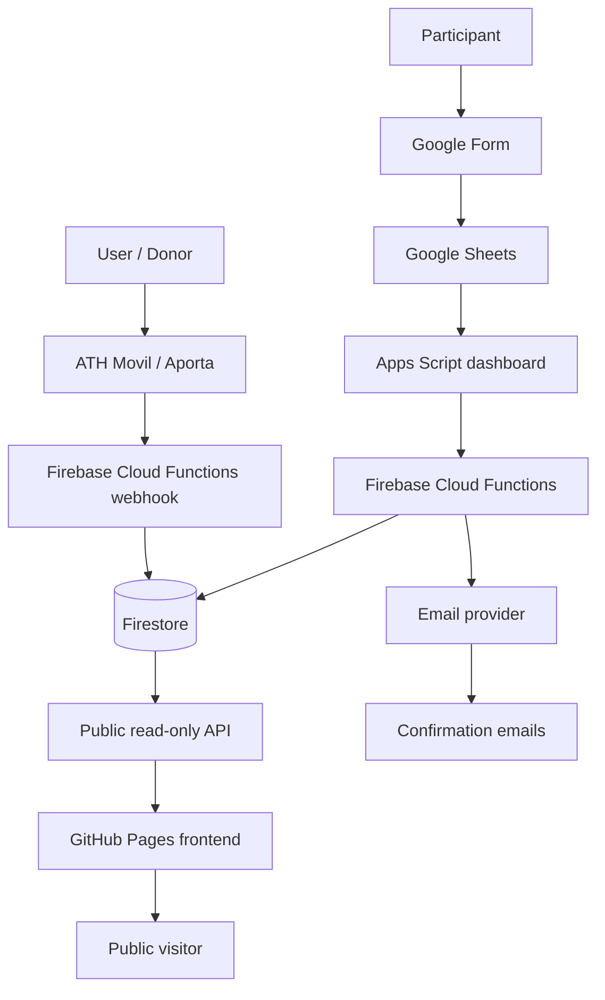

# Abrazo Solidario Junelly

> A production charity fundraising and 5K registration platform built with a serverless, low-cost architecture.

## Live Demo

- Live site: [https://abrazojunelly.org](https://abrazojunelly.org)
- Public frontend repository: [Janiel777/abrazo-junelly-frontend](https://github.com/Janiel777/abrazo-junelly-frontend)

The public website is in Spanish because it serves a Puerto Rico community audience. The repository documentation is in English for recruiters, hiring managers, and technical reviewers.

## Overview

Abrazo Solidario Junelly is a real-world platform built for a community charity 5K event in Puerto Rico. The system supports public fundraising progress, participant registration operations, donation processing, runner number assignment, confirmation emails, manual corrections, and privacy-conscious public reporting.

This public repository contains the static frontend, public assets, fallback sample data, public API integration logic, README, and technical case-study documentation. The production backend, private operational workflows, credentials, and real private records are intentionally not included.

## Problem

A community charity event needed a low-cost way to collect registrations, process donations, confirm participants, assign runner numbers, correct mistakes, track donations, send emails, and show public progress without building or maintaining a large custom admin application.

The workflow also needed to handle real operational edge cases: duplicate registrations, extra donations, payment-to-registration matching, manual corrections, voided or burned runner numbers, pickup codes, audit history, and public reporting that does not expose private participant or donor data.

## Solution

The complete system combines practical operational tools with serverless backend services:

- Google Forms captures participant registration intake.
- Google Sheets acts as the admin dashboard for operational review.
- Google Apps Script automates dashboard actions and correction workflows.
- Firebase Cloud Functions Gen 2 handles backend logic, public APIs, webhooks, and email workflows.
- Firestore stores registrations, donations, audit logs, email batches, and operational state.
- ATH Movil / Aporta webhook processing records donation events.
- Automated matching pairs donations with registrations when possible.
- Email automation sends confirmation and operational messages.
- GitHub Pages hosts the public fundraising progress website on a custom domain.

## Key Features

- Public fundraising progress dashboard.
- Public read-only sanitized donation summary API.
- Paginated public donation grid.
- Media gallery and donation instructions.
- Registration intake through Google Forms.
- Automated runner number assignment.
- Donation-to-registration matching.
- Extra donation handling.
- Manual admin correction workflows.
- Duplicate and voided registration handling.
- Burned runner number support for operational consistency.
- Pickup code generation.
- Email confirmation batches.
- Admin dashboard through Google Sheets and Apps Script.
- Audit-friendly operational records and correction history.
- Privacy-conscious public API with no direct database exposure.

## Tech Stack

### Frontend

- HTML
- CSS
- Vanilla JavaScript
- Responsive design
- GitHub Pages
- Custom domain

### Backend

- Firebase Cloud Functions Gen 2
- Node.js
- Firebase Admin SDK
- Firestore
- HTTP webhooks
- Serverless architecture

### Data / Operations

- Google Forms
- Google Sheets
- Google Apps Script
- Firestore collections for registrations, donations, email batches, audit logs, and dashboard workflows

### Payments / Donations

- ATH Movil / Aporta webhook flow
- Payment and donation event processing
- Donation-to-registration matching
- Extra donation handling
- Public sanitized donation summaries

### Email

- Automated confirmation emails
- Email batch processing
- Provider-backed email delivery

### Deployment / Infrastructure

- GitHub Pages
- Firebase Hosting redirects and branded links
- Custom domain / DNS
- Serverless deployment
- Low-cost nonprofit-oriented architecture

### Security / Privacy

- Public read-only API
- Sanitized public responses
- No direct Firestore access from the browser
- No secrets in the frontend
- No emails, phone numbers, ATH phone numbers, reference numbers, registration IDs, pickup codes, or internal dashboard data exposed publicly
- CORS configured for public read-only access
- Separation between public frontend and private backend operations

## Architecture



## Repository Scope

This repository includes:

- Public frontend
- Static assets
- README and documentation
- Sample fallback data
- Public API integration logic
- GitHub Pages custom domain configuration

This repository does not include:

- Production backend source with secrets
- Private Firestore data
- Private Google Apps Script dashboard code unless intentionally documented
- Real participant private records
- Real donor private contact information
- API secrets
- Service account keys
- Internal payment reference numbers
- Pickup codes or private operational identifiers

## Public API Strategy

The frontend consumes a public read-only endpoint that returns sanitized aggregate data only. The browser does not connect directly to Firestore.

Example response shape:

```json
{
  "raised": 18072,
  "goal": 25000,
  "donorCount": 1046,
  "progressPercent": 72,
  "milestones": [],
  "donations": [],
  "pagination": {}
}
```

Important API rules:

- `raised` is the real total raised and should be used for the fundraising total.
- `goal` is the official fundraising goal.
- `progressPercent` drives the progress bar.
- `donations` is paginated and should not be summed to calculate total raised.
- `donorCount` represents contributions or transactions, not necessarily unique donors.
- Public donation records are shortened and sanitized before they reach the frontend.

## Privacy and Security

The security model separates public presentation from private operations:

- The browser never talks directly to Firestore.
- The public API returns only safe fields.
- Donor names are shortened or anonymized.
- Messages are sanitized before public display.
- Emails and phone numbers are hidden.
- ATH phone numbers and payment reference numbers are not exposed.
- Internal registration IDs, pickup codes, and dashboard-only fields stay private.
- The operational dashboard remains private.
- Secrets are stored in backend environment configuration or secret management, not in this frontend.

## Cost-Conscious Architecture

This architecture was intentionally designed for a nonprofit and community-event context:

- Static frontend hosting reduces public hosting cost.
- GitHub Pages provides free static hosting for the public website.
- Serverless backend services avoid maintaining always-on servers.
- Google Sheets provides a practical admin dashboard for non-engineering workflows.
- Firestore provides flexible persistence for event data and audit records.
- Pay-as-you-go services are used only where operationally necessary.

## Screenshots

Placeholders:

- Public progress page
- Donation page
- Admin dashboard concept

Do not include private real data screenshots unless they are fully sanitized.

## Local Development

Clone the repository:

```bash
git clone https://github.com/Janiel777/abrazo-junelly-frontend.git
cd abrazo-junelly-frontend
```

Run a local static server:

```bash
python -m http.server 5500
```

Then open:

```text
http://127.0.0.1:5500/
```

The frontend can use `src/sample-data.js` as a fallback or connect to the public read-only API configured in `src/main.js`.

## Deployment

- Static frontend deployed through GitHub Pages.
- Custom domain configured through GitHub Pages.
- `CNAME` file included for `abrazojunelly.org`.
- Backend deployed separately through Firebase Cloud Functions.
- DNS records are managed outside this repository.

## Future Improvements

- Optional donor consent for public display names.
- More advanced analytics.
- Better admin reporting.
- Automated public image generation for social media sharing.
- Improved caching and monitoring.
- CI/CD improvements for backend and frontend deployment.
- Stronger operational alerts for unmatched payments and duplicate registrations.

## Resume / Portfolio Value

This project demonstrates full-stack system design, serverless backend development, public/private data separation, payment webhook handling, operational dashboard design, automation, deployment, and privacy-conscious engineering for a real deployed community platform.

## Author

Built by Janiel Núñez.
