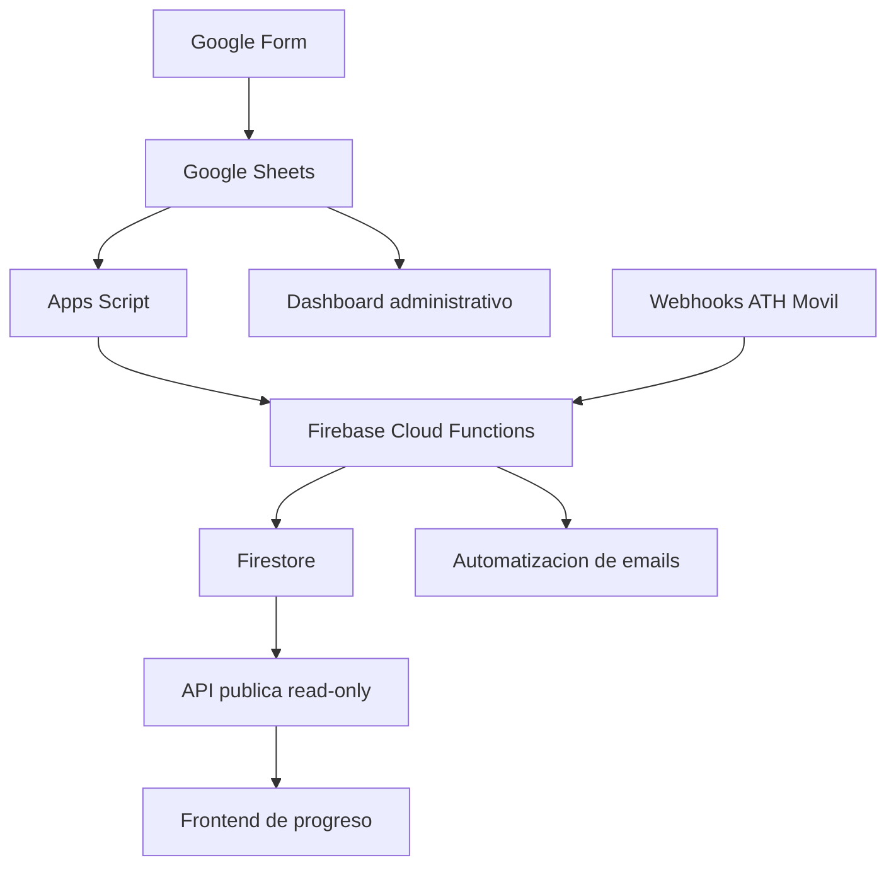

# Arquitectura del sistema

Este documento describe la arquitectura general del sistema de inscripcion y donaciones de Abrazo Solidario para Junelly. El repositorio publico contiene solo el frontend y documentacion de case study; el backend real no esta incluido por seguridad y privacidad.

## Componentes

### Google Forms

Google Forms reduce friccion para participantes y permite capturar registros rapidamente sin construir un formulario administrativo desde cero.

### Google Sheets

Google Sheets funciona como dashboard operacional porque es familiar, facil de auditar manualmente y suficientemente flexible para un evento comunitario.

### Apps Script

Apps Script automatiza acciones desde el dashboard, como correcciones, asignaciones manuales, cambios de estado y tareas administrativas.

### Firebase Cloud Functions

Cloud Functions contiene la logica serverless para procesar eventos, recibir webhooks, validar datos, coordinar actualizaciones y preparar respuestas para otros servicios.

### Firestore

Firestore almacena registros, donaciones, estados, auditoria y datos operacionales. No se expone directamente al frontend publico.

### Webhooks de ATH Movil

Los webhooks notifican pagos o donaciones para que el sistema pueda intentar parearlos con registros existentes y actualizar estados.

### Automatizacion de emails

Los emails automaticos comunican confirmaciones y estados importantes. El proveedor real y sus credenciales no pertenecen al repositorio publico.

### Dashboard administrativo

El dashboard permite revisar confirmaciones, pagos no pareados, duplicados, asignaciones manuales y correcciones de datos.

### API publica read-only

La API futura debe devolver solo datos agregados y sanitizados, sin informacion privada de participantes, telefonos, emails o referencias de pago.

### Frontend de progreso

El frontend es una pagina estatica que muestra el progreso de la causa y sirve como presentacion publica del proyecto.
