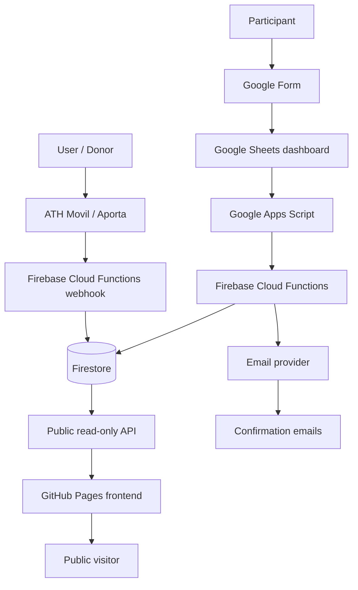

# System Architecture

Abrazo Solidario Junelly is a production community fundraising and 5K registration platform. The public repository contains the frontend and documentation, while the private backend and operational data are intentionally kept out of the public repo.

## Public Frontend

The frontend is a static site hosted on GitHub Pages with a custom domain. It shows fundraising progress, a media gallery, donation instructions, and a paginated grid of sanitized public donations.

The browser only calls the public read-only API. It does not connect directly to Firestore and does not include Firebase credentials.

## Registration Intake

Google Forms provides a low-friction registration flow for participants. Form submissions are routed into Google Sheets, where the operations team can review records and trigger administrative actions.

## Admin Dashboard

Google Sheets works as the operational dashboard. Apps Script adds automation for correction workflows, runner number assignment, duplicate handling, manual review, and dashboard actions.

## Backend

Firebase Cloud Functions Gen 2 handles webhook processing, API routes, matching logic, email workflows, correction actions, and integration with Firestore.

## Database

Firestore stores registrations, donations, public summary data, email batches, audit logs, and operational state. Private collections and sensitive fields are not exposed to the public frontend.

## Payment / Donation Webhooks

ATH Movil / Aporta webhook events are processed by backend functions. Donations can be matched to registrations, stored as extra donations, or marked for manual review depending on available information.

## Public API

The public API returns sanitized aggregate data and paginated donation records. It is designed for public read-only access and excludes private operational data.
